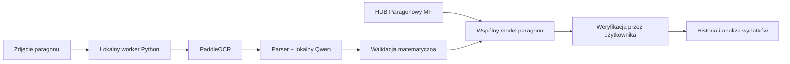
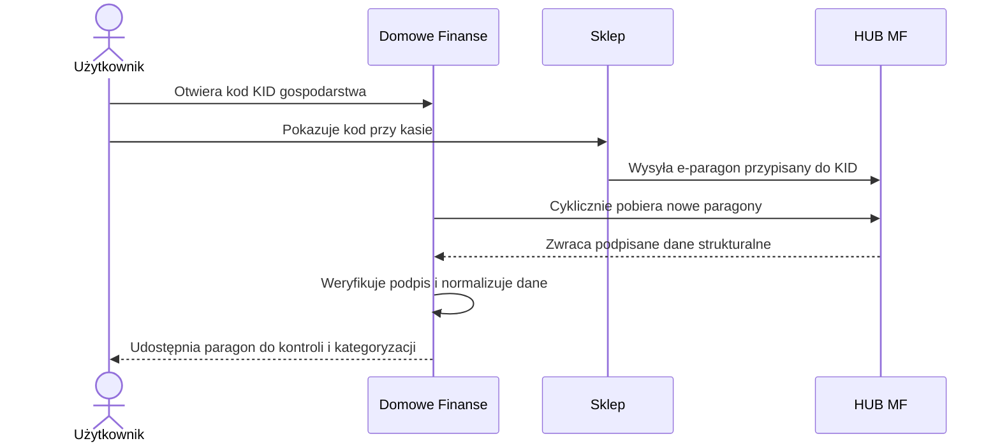
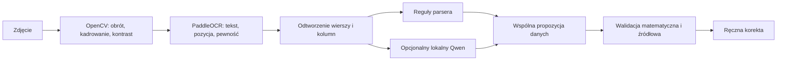
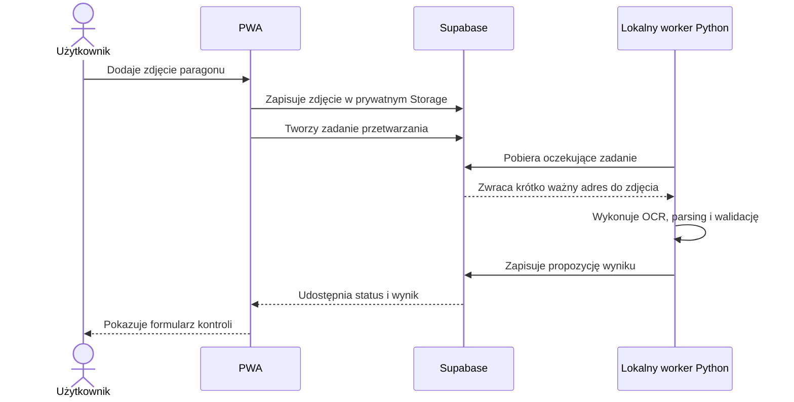

# Research: rozpoznawanie i import paragonów

## Status dokumentu

- Temat: pozyskiwanie danych z e-paragonów i zdjęć paragonów papierowych
- Etap: rekomendacja architektoniczna przed implementacją
- Priorytet: brak kosztów zależnych od liczby tokenów lub dokumentów
- Zakładana skala: około 30 paragonów miesięcznie

## Wniosek

Rekomendowane jest rozwiązanie dwutorowe:

1. **HUB Paragonowy Ministerstwa Finansów jako podstawowe źródło** — gdy sklep wystawia e-paragon.
2. **Lokalne rozpoznawanie zdjęć jako uzupełnienie** — dla paragonów papierowych, sklepów bez integracji i starszych dokumentów.

Dzięki temu dostępne e-paragony trafią do aplikacji jako dane strukturalne, bez OCR, kosztów tokenów i ryzyka błędnego odczytania kwot. Zdjęcia pozostają konieczne jako źródło zapasowe.

## 1. HUB Paragonowy Ministerstwa Finansów

Ministerstwo Finansów udostępnia bezpłatne REST API dla aplikacji zewnętrznych. API pozwala pobierać listę e-paragonów oraz szczegóły konkretnego dokumentu. Dokumentacja dopuszcza aplikację pobierającą paragony dla wielu klientów.

E-paragon zawiera dane strukturalne, między innymi:

- nazwę pozycji,
- ilość,
- cenę jednostkową,
- wartość pozycji,
- stawki i wartości podatkowe,
- rabaty i podsumowania,
- identyfikatory dokumentu,
- podpisany fiskalny dokument JWS.

Dla takich dokumentów nie potrzebujemy OCR ani modelu AI. Backend powinien zweryfikować podpis dokumentu i przekształcić dane MF do wspólnego modelu aplikacji.

### Proponowany przepływ

1. Gospodarstwo domowe otrzymuje identyfikator KID.
2. Publiczna część KID jest pokazywana w aplikacji jako kod kreskowy.
3. Przy kasie użytkownik prosi o e-paragon i pokazuje kod.
4. Backend cyklicznie pobiera nowe paragony z HUB.
5. Paragon trafia automatycznie do listy wydatków.
6. Użytkownik poprawia jedynie kategorię albo nieczytelną lub skróconą nazwę produktu.

Oficjalna aplikacja MF pozwala współdzielić KID między urządzeniami i osobami, również w kontekście wspólnego zarządzania wydatkami rodziny.

### Ograniczenia i ryzyka

- Sklep musi obsługiwać e-paragony i mieć tę funkcję aktywną. Zgodność używanej kasy nie oznacza jeszcze, że każdy sklep oferuje usługę.
- Użytkownik musi poprosić o e-paragon i przedstawić KID przed zakończeniem sprzedaży.
- Nazwa produktu pochodzi z systemu kasowego i nadal może być skrócona, na przykład `MLEK UHT 3,2 1L`. Potrzebny będzie słownik aliasów produktów, ale nie trzeba odgadywać znaków i cen ze zdjęcia.
- Paragony są po pewnym czasie usuwane z HUB. Backend powinien pobierać je regularnie i zapisywać lokalnie.
- Prywatna część KID jest sekretem. Musi być szyfrowana, nie może trafić do frontendu, logów ani tabel dostępnych bezpośrednio z przeglądarki.
- Uzyskanie nowego KID wymaga certyfikatu producenta aplikacji i połączenia mTLS. MF rejestruje takie certyfikaty.
- Warto zbadać import KID utworzonego w oficjalnej aplikacji MF. Specyfikacja transferu nadal pokazuje certyfikat klienta, dlatego nie należy zakładać, że ominie to rejestrację producenta. Wymaga to potwierdzenia z MF pod adresem `e-paragony@mf.gov.pl`.

### Wstępna decyzja produktowa

Rekomendowany jest **jeden KID na gospodarstwo domowe**, jeżeli jego członkowie faktycznie współdzielą finanse. Konsekwencją jest dostęp każdego uprawnionego członka do wszystkich paragonów przypisanych do tego KID. Ta decyzja wymaga osobnej akceptacji podczas projektowania uprawnień.

## 2. Zdjęcia papierowych paragonów

Rekomendowanym punktem startowym jest lokalny backend Python z następującym przepływem:

### Rekomendowane komponenty

| Komponent | Rola | Rekomendacja |
|---|---|---|
| PaddleOCR PP-OCRv5 `pl` | Odczyt tekstu, pozycji i pewności znaków | Podstawowy OCR |
| PP-OCRv6 | Nowszy konkurent do benchmarku | Testować, ale nie przyjmować bez pomiarów |
| OpenCV | Prostowanie, obrót, kontrast i przycięcie | Obowiązkowe przygotowanie obrazu |
| Qwen 3.5 0.8B lub 2B | Lokalna interpretacja tekstu i układu | Opcjonalny parser |
| Reguły matematyczne | Kontrola cen, ilości, rabatów i sumy | Obowiązkowe |
| Donut CORD | Bezpośrednie przekształcenie zdjęcia w JSON | Eksperymentalny konkurent |
| Tesseract | Prosty punkt odniesienia | Nie jako główny silnik |

PaddleOCR działa lokalnie, ma licencję Apache 2.0 i obsługuje język polski przez model łaciński PP-OCRv5.

### Dlaczego nie należy opierać rozwiązania wyłącznie na modelu multimodalnym

Nie rekomenduje się użycia samego modelu multimodalnego do generowania gotowego JSON-a, ponieważ:

1. Trudniej wskazać, z którego wiersza pochodzi konkretna cena.
2. Model może wygenerować prawdopodobną, ale nieistniejącą wartość.
3. Błędy matematyczne mogą wyglądać wiarygodnie.
4. Zmiana wersji modelu może zmienić zachowanie parsera.

Lepszym rozwiązaniem jest przekazanie do lokalnego modelu tekstu, współrzędnych i poziomu pewności z OCR. Model może zaproponować strukturę, ale każda liczba musi wskazywać wiersz źródłowy i przejść deterministyczną walidację.

Lokalny Qwen może działać bez płatnego API. Odpowiedź można ograniczyć do schematu JSON przez llama.cpp lub Ollama. Poprawny JSON gwarantuje jednak tylko strukturę, a nie poprawność danych.

Donut posiada gotowy model trenowany do paragonów, ale bazuje na indonezyjskim zbiorze CORD. Powinien być benchmarkiem, a nie domyślnym rozwiązaniem dla polskich paragonów.

## 3. Architektura bez stałego serwera

Na pierwszym etapie nie należy wystawiać publicznego API Python działającego na prywatnym komputerze. Prostszym i bezpieczniejszym rozwiązaniem jest lokalny worker pobierający zadania.

Przepływ działania:

1. Zdjęcie trafia do prywatnego Supabase Storage.
2. W Supabase powstaje zadanie oczekujące na przetworzenie.
3. Lokalny worker Python odpytuje kolejkę.
4. Pobiera zdjęcie przez krótko ważny podpisany adres.
5. Przetwarza dokument lokalnie.
6. Zapisuje propozycję wyniku.
7. Frontend pokazuje status i ekran korekty.

Komputer może być wyłączony. Zadania będą czekały i zostaną wykonane po ponownym uruchomieniu workera.

Ciężkiego OCR lub lokalnego modelu nie należy umieszczać w Supabase Edge Function. Funkcja powinna obsługiwać uwierzytelnienie, utworzenie zadania i przyjęcie wyniku, natomiast obliczenia powinien wykonywać worker.

### Możliwości późniejszego publicznego uruchomienia

- **Cloudflare Tunnel** — nie wymaga otwierania portów, ale backend działa tylko wtedy, gdy komputer jest uruchomiony.
- **Cloudflare Containers** — możliwy późniejszy hosting obrazu z Pythonem; jest płatny i wymaga wcześniejszego pomiaru CPU, RAM i czasu startu.
- **Mały VPS** — prawdopodobnie najprostszy docelowy wariant dla cięższego OCR lub modelu 2B, jeżeli wymagane będzie działanie 24/7.

Przy około 30 paragonach miesięcznie lokalny worker jest najbardziej racjonalny kosztowo.

## 4. Dostępne zasoby sprzętowe

Obecny komputer ma:

- Intel i7-11850H, 8 rdzeni i 16 wątków,
- około 32 GB RAM,
- NVIDIA RTX A2000 Laptop z 4 GB VRAM.

Zasoby powinny wystarczyć do:

- PaddleOCR na CPU,
- małego lokalnego modelu 0.8B–2B,
- przetwarzania pojedynczego paragonu w tle,
- porównania kilku wariantów pipeline'u.

GPU może przyspieszyć część testów, ale pierwszą wersję należy uruchomić na CPU. Upraszcza to instalację i późniejsze przeniesienie rozwiązania na serwer bez GPU.

Python i Docker nie są obecnie zainstalowane. Będą potrzebne dopiero podczas implementacji.

## 5. Zewnętrzny punkt odniesienia

Do benchmarku warto wykorzystać **Azure Document Intelligence — prebuilt receipt**. Model oficjalnie obsługuje polskie paragony termiczne oraz zwraca pozycje, ilości, ceny jednostkowe i sumy.

Dla obecnego wolumenu darmowy poziom testowy może wystarczyć, ale Azure powinien być traktowany tylko jako:

- wzorzec do porównania jakości,
- opcjonalny awaryjny fallback,
- sposób ustalenia, czy lokalne rozwiązanie osiąga akceptowalny wynik.

Nie należy budować od niego podstawowej zależności produktu ze względu na prywatność, możliwość zmiany cennika i uzależnienie od dostawcy.

## 6. Plan benchmarku

Pierwszy test powinien objąć co najmniej 10 prawdziwych polskich paragonów, a docelowy zbiór 20–50 dokumentów z kilku sieci i o różnej jakości.

### Porównywane warianty

1. PaddleOCR + reguły.
2. PaddleOCR + lokalny Qwen + reguły.
3. Donut CORD.
4. Azure Receipt jako zewnętrzny punkt odniesienia.
5. Opcjonalnie Tesseract jako baseline.

### Metryki

- poprawność nazwy sklepu, daty i całkowitej kwoty,
- wykrycie wszystkich pozycji,
- poprawne sparowanie nazwy i ceny,
- poprawność ilości, cen jednostkowych i rabatów,
- liczba wymyślonych wartości liczbowych,
- liczba ręcznych korekt,
- zgodność sumy pozycji z sumą paragonu,
- czas przetwarzania,
- maksymalne zużycie RAM i VRAM.

### Proponowane kryteria MVP

- sklep, data i suma: co najmniej 95% dokładności,
- nazwa i cena pozycji: F1 co najmniej 85%,
- zero zaakceptowanych wartości liczbowych bez wskazanego źródła,
- błędna suma zawsze kieruje paragon do ręcznej kontroli,
- mediana nie większa niż 2–3 korekty na paragon.

Kryteria są propozycją do zatwierdzenia, a nie przyjętymi jeszcze wymaganiami biznesowymi.

## 7. Bezpieczeństwo i model danych

Oba źródła powinny być normalizowane do jednego wewnętrznego modelu paragonu, ale surowe dane źródłowe nie powinny być nadpisywane.

Każdy dokument powinien zachować co najmniej:

- źródło: `hub_mf` albo `image_ocr`,
- identyfikator gospodarstwa domowego,
- identyfikator dokumentu źródłowego,
- surowy payload lub jego bezpieczny zapis,
- hash źródła do deduplikacji,
- wersję parsera,
- poziom pewności pól,
- powiązanie pola z wierszem źródłowym,
- status walidacji i ręcznej weryfikacji.

W przyszłej implementacji wymagane będą:

- prywatny bucket na zdjęcia,
- RLS ograniczające dostęp do członków gospodarstwa,
- szyfrowanie prywatnego KID,
- backendowa obsługa certyfikatu MF,
- brak klucza `service_role` i innych sekretów we frontendzie,
- krótko ważne podpisane adresy do plików,
- polityka retencji oryginalnych zdjęć,
- ochrona publicznych endpointów przed nadużyciami.

## 8. Rekomendowana kolejność dalszych prac

1. Potwierdzić z MF wymagania certyfikatu producenta i transferu KID.
2. Zaprojektować wspólny model danych dla paragonu z HUB i ze zdjęcia.
3. Wykonać benchmark OCR na 10 polskich paragonach.
4. Na podstawie wyników wybrać pomiędzy regułami a lokalnym Qwen.
5. Uruchomić lokalnego workera z kolejką Supabase.
6. Publiczny serwer rozważyć dopiero po zmierzeniu rzeczywistego czasu i wykorzystania zasobów.

Najważniejsza decyzja brzmi: **HUB MF powinien być źródłem preferowanym, a OCR mechanizmem uzupełniającym**. Zmniejszy to liczbę dokumentów wymagających interpretacji obrazu i nie uzależni aplikacji od płatnego modelu AI.

## Źródła

### Ministerstwo Finansów

- [HUB Paragonowy MF](https://www.podatki.gov.pl/aplikacja-e-paragony/hub-paragonowy)
- [Specyfikacja protokołu klient–HUB](https://www.podatki.gov.pl/media/9000/opis-techniczny-protoko%C5%82u-komunikacyjnego-hub-paragonowy-specyfikacja-komend-klient-hub-v1-0-1.pdf)
- [Standardy kryptograficzne i struktura paragonu](https://www.podatki.gov.pl/media/2osbg2bb/opis-techniczny-protoko%C5%82u-komunikacyjnego-kasa_standardy-kryptograficzne-v-4-0-0.pdf)
- [Komentarz do transferu KID](https://www.podatki.gov.pl/media/jrnfzu4j/komentarz-do-punkt%C3%B3w-2-3-4-i-2-3-5-w-specyfikacji-komend-klient-hub.pdf)
- [Współdzielenie KID w aplikacji e-Paragony](https://www.podatki.gov.pl/wyjasnienia/nowa-wersja-aplikacji-mobilnej-e-paragony-przelom-w-zarzadzaniu-i-kontroli-nad-codziennymi-wydatkami/?altTemplate=ArticlePdf&download=True)
- [Kasy kompatybilne z HUB](https://www.podatki.gov.pl/aplikacja-e-paragony/kasy-kompatybilne)

### OCR i modele lokalne

- [PaddleOCR](https://github.com/PaddlePaddle/PaddleOCR)
- [Obsługa języków w PP-OCRv5](https://github.com/PaddlePaddle/PaddleOCR/blob/main/docs/version3.x/algorithm/PP-OCRv5/PP-OCRv5_multi_languages.en.md)
- [Instalacja PaddleOCR](https://www.paddleocr.ai/main/en/version3.x/installation.html)
- [Qwen 3.5 0.8B](https://huggingface.co/Qwen/Qwen3.5-0.8B)
- [llama.cpp server](https://github.com/ggml-org/llama.cpp/blob/master/tools/server/README.md)
- [Donut](https://github.com/clovaai/donut)
- [CORD](https://github.com/clovaai/cord)
- [Tesseract OCR](https://github.com/tesseract-ocr/tesseract)

### Supabase i Cloudflare

- [Supabase Queues](https://supabase.com/docs/guides/queues)
- [Pobieranie prywatnych plików przez signed URLs](https://supabase.com/docs/guides/storage/serving/downloads)
- [Supabase Edge Functions](https://supabase.com/docs/guides/functions)
- [Cloudflare Tunnel](https://developers.cloudflare.com/cloudflare-one/networks/connectors/cloudflare-tunnel/)
- [Cloudflare Workers — cennik](https://developers.cloudflare.com/workers/platform/pricing/)
- [Cloudflare Containers — limity](https://developers.cloudflare.com/containers/platform-details/limits/)

### Zewnętrzny benchmark

- [Azure Document Intelligence — receipt model](https://learn.microsoft.com/en-us/azure/ai-services/document-intelligence/prebuilt/receipt)
- [Języki obsługiwane przez modele prebuilt](https://learn.microsoft.com/en-us/azure/ai-services/document-intelligence/language-support/prebuilt)
- [Cennik Azure Document Intelligence](https://azure.microsoft.com/en-us/pricing/details/document-intelligence/)
